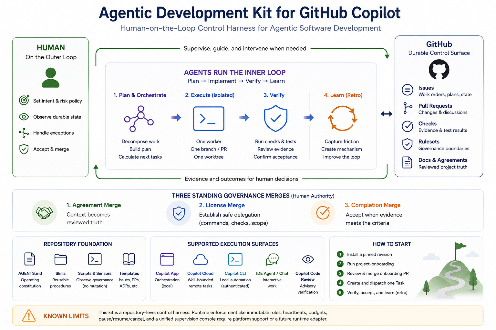

<p align="center">
  
</p>

<h1 align="center">Agentic Development Kit for GitHub Copilot</h1>

<p align="center">
  <strong>A GitHub-native, Copilot-app-first Human-on-the-Loop control harness for agentic software development.</strong>
</p>

<p align="center">
  <a href="https://github.com/mochan-tk/agentic-dev-kit-for-copilot/actions/workflows/ci.yml">
    
  </a>
  <a href="LICENSE">
    
  </a>
</p>

GitHub Copilot agents run bounded inner loops: they plan, implement, test,
repair, and return evidence. Humans stay on the outer loop: they set intent
and risk policy, observe durable state, intervene on exceptions, and retain
agreement, acceptance, and merge authority.

This kit turns GitHub into the shared control surface:

- **Issues** hold work orders, plans, dependencies, escalations, and outcomes.
- **Copilot app sessions** provide the nested execution and supervision tree.
- **Worktrees, branches, and pull requests** isolate implementation work.
- **Checks and evidence tables** make completion claims testable.
- **Rulesets and governance sensors** expose delegation boundaries.
- **Retrospectives** improve the loop itself, not only the latest output.

It does not replace Scrum, Kanban, Waterfall, or your delivery lifecycle. It
adds a control layer for delegating work without making chat history, model
memory, or agent self-report the source of truth.

> [!IMPORTANT]
> The complete orchestration model is designed around the **GitHub Copilot
> app**. Nested parent/child sessions, the multi-session sidebar, isolated
> worktrees, and session-control tools are part of the operating model.
>
> A bounded implementation Task may occasionally be handed off to another
> suitable environment, but those environments are not interchangeable
> runtimes for the complete lifecycle.

## How it works

<p align="center">
  <a href="docs/images/agentic-development-kit-overview.png">
    
  </a>
</p>

The Copilot app runs the nested execution hierarchy. GitHub holds the durable
state. Humans supervise intent, risk, exceptions, and acceptance from the
outer loop.

```text
Project session
└─ Epic #<n> orchestrator session
   └─ Task #<n> supervisor session
      └─ PR #<n> worker session
```

The **Project session** supervises the complete Epic set for one
repository-level initiative. It is unrelated to a GitHub Projects board.

| Session | Responsibility |
|---|---|
| **Project** | Start Epic sessions, watch across phases, and replan the outline |
| **Epic orchestrator** | Calculate the frontier, dispatch Tasks, monitor, integrate, and replan |
| **Task supervisor** | Claim, plan, apply risk gates, create the worker, verify, escalate, and record the outcome |
| **PR worker** | Implement, test, repair, commit, and update one PR inside its ownership boundary |

Project and Epic sessions conduct; they do not implement.

## Why this exists

Without a harness, agent work becomes hard to see, decisions scatter across
sessions, and delegation boundaries remain vague.

A completion claim therefore needs durable answers: which Task ran, which PR
contains the change, which checks passed, what remains uncertain, and who has
authority to accept it.

Session history is useful transport, but it is not shared, authoritative
project state. Anything that must outlive one execution lands on GitHub.

Trust attaches to a bounded Task, owned paths, deterministic checks, evidence,
and escalation paths—not to a model name or an agent's confidence.

## Human-on-the-Loop by design

**Human-on-the-Loop (HOTL)** means routine work can proceed without a human
approving every tool call, while the human remains able to observe, stop,
redirect, reject, or accept the work.

| Mode | Typical trigger | Human role |
|---|---|---|
| **Human-on-the-Loop** | Normal, bounded, reversible work | Observe durable state and intervene on exceptions |
| **Human-in-the-Loop** | `risk:high`, ambiguity, scope drift, irreversible action | Approve or decide before work continues |
| **Human-in-Command** | Agreements, governance exceptions, acceptance, merge | Retain authority and accountability |

The normal path is HOTL. The process returns to HITL when risk, ambiguity, or
evidence quality requires it.

### Three governance merges

| Merge | What becomes authoritative |
|---|---|
| **Agreement merge** | Distilled context becomes reviewed project truth |
| **License merge** | Onboarding evidence establishes delegation readiness |
| **Completion merge** | A Task PR is accepted because its evidence supports the acceptance criteria |

“License” means **delegation readiness**, not the repository's legal license.
Humans may also intervene through `needs:human`, `needs:replan`, failed
checks, review comments, or the `risk:high` gate.

## Core disciplines and loops

| Discipline | Rule |
|---|---|
| **record-before-report** | Write the durable Issue or PR record before sending a session message |
| **verify-before-done** | Cite current ground truth—not memory |
| **single-writer** | Parallel Tasks own disjoint paths; otherwise serialize them |
| **escalate-don't-guess** | Ambiguity, contradiction, blockage, or scope drift returns to a human or replanning path |

The full operating constitution lives in [`AGENTS.md`](AGENTS.md).

```text
Worker loop:   edit → test → observe → repair
Task loop:     claim → plan → dispatch → verify → outcome
Epic loop:     frontier → dispatch → integrate → replan
Project loop:  start phase → watch across Epics → replan
Learning loop: friction → retro → mechanism → future improvement
```

This is **Loop Engineering**: improve the harness around the agent, not only
the prompt. Repeated failures become instructions, Skills, templates, tests,
or CI guards. General improvements can be upstreamed to this scaffold.

## Lifecycle

| Phase | What happens | Human role |
|---|---|---|
| **0. Onboard** | Inventory, validate commands, tune the scaffold, draft Epics, and open an evidence PR | Review and merge delegation readiness |
| **1. Collect** | Land raw information with provenance | Provide or approve sources |
| **2. Distill and agree** | Promote durable decisions into requirements, ADRs, glossary entries, and non-goals | Approve the agreement merge |
| **3. Plan and orchestrate** | Build a rolling-wave Issue graph and calculate the actionable frontier | Set goals, priorities, constraints, and exceptions |
| **4. Route and execute** | Keep supervision in the app and run each implementation worker in the appropriate environment | Stay on the loop; approve risk-gated work |
| **5. Verify and learn** | Run checks, review evidence, accept or replan, and promote repeated friction | Accept, reject, redirect, or approve a retro |

## One Task, end to end

1. Create a Task Issue with objective, acceptance criteria, out-of-scope
   boundary, file ownership, verification, routing, and handoff notes.
2. The Epic orchestrator opens a dedicated Task supervisor session.
3. The supervisor claims the Task and records the plan.
4. A `risk:high` Task pauses for approval; ordinary work proceeds through
   lazy consensus.
5. The supervisor creates one active implementation worker.
6. The worker implements and verifies one pull request.
7. The supervisor independently checks the PR, diff, checks, ownership, and
   evidence against current GitHub state.
8. A human accepts, redirects, or rejects the work; repeated friction enters
   the retro loop.

```text
The Epic set     = one Project session
One Epic Issue   = one Epic orchestrator session
One Task Issue   = one Task supervisor session
One pull request = one active worker + one worktree + one branch
```

A declared trivial Task may use the Task-supervisor no-worker exemption.
Project and Epic conductors may not.

The full control hierarchy remains in the Copilot app. When an implementation
Task requires a different environment, the Task may be handed off while its
Issue and pull request remain authoritative. See
[`task-routing`](.github/skills/task-routing/SKILL.md).

## Quick start

### Prerequisites

- a GitHub repository;
- the **GitHub Copilot app**;
- authenticated [`gh`](https://cli.github.com/);
- `jq`;
- Git and Bash 3.2 or later;
- on Windows, [Git for Windows](https://gitforwindows.org/).

Availability depends on GitHub and Copilot plans, repository visibility, and
organization policy. Check the
[official GitHub Copilot documentation](https://docs.github.com/en/copilot)
for current requirements.

Public repositories work on any GitHub plan; private repositories require a
paid plan because `setup-sources.sh` fails closed for private repositories on
GitHub Free.

### 1. Install

Run the installer from the root of a new or existing Git repository.

#### macOS / Linux

```sh
curl -fsSL https://raw.githubusercontent.com/mochan-tk/agentic-dev-kit-for-copilot/main/.github/scripts/scaffold-init.sh | bash
```

#### Windows PowerShell

```powershell
irm https://raw.githubusercontent.com/mochan-tk/agentic-dev-kit-for-copilot/main/.github/scripts/scaffold-init.ps1 | iex
```

On Windows, the bootstrap locates Git Bash from Git for Windows and runs the
same canonical installer used on macOS and Linux.

The installer stages files but does not commit them, refuses unexpected
collisions and symlinked paths, and records the resolved scaffold revision.

Land the adoption commit on the remote default branch before onboarding.

After installation, run scaffold Bash scripts on Windows through the included
launcher:

```powershell
pwsh .github/scripts/run.ps1 tuning-status.sh
```

### 2. Onboard in the Copilot app

Run
[`project-onboarding`](.github/skills/project-onboarding/SKILL.md).

It inventories the repository, verifies commands, tunes the scaffold, drafts
phase Epics, opens one evidence PR, and creates the top-level session named
`Project`.

Review and merge the evidence PR—the **license merge**. Onboarding is complete
when this succeeds on the merged default branch:

```sh
bash .github/scripts/tuning-status.sh
```

On Windows:

```powershell
pwsh .github/scripts/run.ps1 tuning-status.sh
```

### 3. Start the Project session

Tell the `Project` session to start after the onboarding PR merges. It opens
the first actionable Epic session, which decomposes the phase into bounded
Task Issues.

### 4. Close the first loop

Dispatch one Task, review its evidence-bearing PR, accept or redirect it, and
record repeated friction through the `retro` Skill.

## Governance and safety

The kit includes read-only sensors for Task ownership overlap, effective
branch governance, and governance drift after upgrades. Ruleset changes
remain explicit adopter actions.

`UNKNOWN` and `UNCHECKABLE` are non-success states, not permission to proceed.

See:

- [ADR-0004: governance sensors and actuators](.github/docs/agreements/adr/ADR-0004-hotl-governance-sensors.md)
- [`governance-status.sh`](.github/scripts/governance-status.sh)
- [`ownership-overlap.sh`](.github/scripts/ownership-overlap.sh)
- [`governance-drift.sh`](.github/scripts/governance-drift.sh)

> [!NOTE]
> This is a repository-level harness, not a complete runtime control plane.
> Repository files cannot truthfully provide immutable runtime roles,
> authenticated session-transition events, heartbeats, budgets, circuit
> breakers, universal pause/resume/cancel, or a unified supervision console.

Issue
[#6: Ritual wall threat model](https://github.com/mochan-tk/agentic-dev-kit-for-copilot/issues/6)
tracks the authenticity and freshness limits of comment-based ritual evidence.

## Documentation

| Topic | Source |
|---|---|
| Operating constitution | [`AGENTS.md`](AGENTS.md) |
| Project onboarding | [`project-onboarding`](.github/skills/project-onboarding/SKILL.md) |
| Planning and frontier | [`plan-management`](.github/skills/plan-management/SKILL.md) |
| Session hierarchy and Task ritual | [`session-orchestration`](.github/skills/session-orchestration/SKILL.md) |
| Worker routing | [`task-routing`](.github/skills/task-routing/SKILL.md) |
| Evidence and completion gates | [`verification`](.github/skills/verification/SKILL.md) |
| Learning and upstreaming | [`retro`](.github/skills/retro/SKILL.md) |
| Version and upgrades | [`SCAFFOLD-CHANGELOG.md`](SCAFFOLD-CHANGELOG.md) |

This project is not a replacement for your delivery methodology, a hosted
autonomous runtime, or a guarantee that agent-generated code is correct. It
is a versioned harness for deciding **what may be delegated, under which
constraints, with which evidence, and where humans retain authority**.

## Contributing

Use the same process the scaffold defines: bounded Task, explicit ownership,
plan before implementation, one active worker, evidence before completion,
and retro for repeated friction. Start with [`AGENTS.md`](AGENTS.md).

## License

Licensed under the [MIT License](LICENSE).
